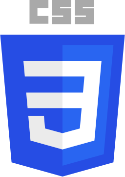

- 👋 Hi, I'm Christien `[kris-TEEN]`
- 👀 I’m looking to collaborate on a fun project
- 🌱 I’m currently working on projects using React and Typescript
- 📫 How to reach me: info@christienng.com
- ⚡ Fun fact: I can recite the alphabet backwards in under 5 seconds

<!--  

Please see <a href="http://christienng.com">my website</a> for more information!
 -->
 

<!-- PROJECTS -->
<h2 align="center" color="white">Projects</h2>

	<table>
		<tr>
			<td valign="top" width="50%">
				
  
					<h3 color="white">Pokédex</h3>
					
					 
					 
					

						  
							
					

					
<strong>Python, HTML, CSS, Bootstrap, Flask</strong> - A platform for Pokémon fans to explore a well-documented archive of Pokémon.

				

			</td>
			<td valign="top" width="50%">
				
  
					<h3 color="white">Spotify Web Player Clone</h3>
					
					 
					 
					

						  
							
					

					
<strong>PostgreSQL, Express, React, Node</strong> - Fullstack clone of Spotify's web player.

				

		<tr>
		<td valign="top" width="50%">
			
  
				<h3 color="white">Connect 4</h3>
				
				 
				 
				

					  
						
				

				 
<strong>JavaScript, CSS3, HTML5</strong> - A classic game as my first attempt to work with OOP.

			

		</td>
		<td valign="top" width="50%">
			
  
				<h3 color="white">TV Maze</h3>
				
				 
				 
				

					  
						
				

				
<strong>JavaScript, Axios, HTML, CSS, Bootstrap</strong> - A front-end interface for users to search shows as one of my first attemps at working with APIs.

			
	
		</td>
	</table>

 

	

 
<!-- TECHNOLOGIES -->
<h2 align="center" color="white">Tech Stack</h2>

<table>
	<tr>
		<td valign="top" width="33.3333%">
			<h3 align="center" color="white">Frontend</h3>
			 
				
  
					
						&nbsp&nbsp&nbsp
					
						&nbsp&nbsp&nbsp
					  
						&nbsp&nbsp&nbsp
					 
						&nbsp&nbsp&nbsp
					 
						&nbsp&nbsp&nbsp
					 
				

			</td>
			<td valign="top" width="33.3333%">
				<h3 align="center" color="white">Backend</h3>
				 
				

					&nbsp
					  
					&nbsp&nbsp&nbsp
					 
					&nbsp&nbsp&nbsp
					  
					&nbsp&nbsp&nbsp
					 
					&nbsp&nbsp&nbsp
					
					&nbsp&nbsp&nbsp
					
					&nbsp&nbsp&nbsp
					
					&nbsp&nbsp&nbsp
					
					&nbsp&nbsp&nbsp
					
					&nbsp&nbsp&nbsp
					
					 
					 	
				

			</td>
			<td valign="top" width="33.3333%">	
				<h3 align="center" color="white">Other Software</h3>
				 
				

					&nbsp
					
					&nbsp&nbsp&nbsp
					
					&nbsp&nbsp&nbsp
					
					&nbsp&nbsp&nbsp
					
					&nbsp&nbsp&nbsp
					 
					&nbsp&nbsp&nbsp
					  
					&nbsp&nbsp&nbsp
					  
					&nbsp&nbsp&nbsp
					 
					&nbsp&nbsp&nbsp
					   	
				

			</td>
		</tr>
	</table>

 

<!-- CONTACT -->
<h2 align="center" color="white">Let's connect!</h2>

	
	&nbsp&nbsp&nbsp
	
	&nbsp&nbsp&nbsp
	

